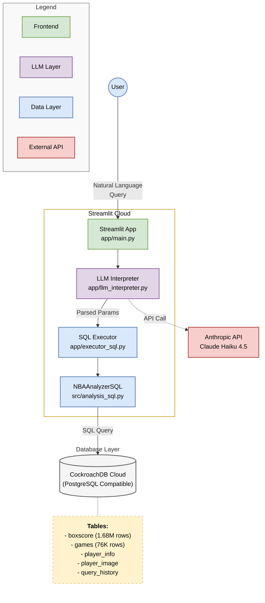

# システムアーキテクチャ図

`docs/architecture.drawio` の内容を Mermaid 形式で可視化したよ！
GitHub や VS Code のプレビューでそのまま図として見れるから超便利✨

```mermaid
graph TD
    %% --- スタイル定義 ---
    classDef user fill:#dae8fc,stroke:#6c8ebf,stroke-width:2px,color:black;
    classDef frontend fill:#d5e8d4,stroke:#82b366,stroke-width:2px,color:black;
    classDef llm fill:#e1d5e7,stroke:#9673a6,stroke-width:2px,color:black;
    classDef data fill:#dae8fc,stroke:#6c8ebf,stroke-width:2px,color:black;
    classDef external fill:#f8cecc,stroke:#b85450,stroke-width:2px,color:black;
    classDef db fill:#f5f5f5,stroke:#666666,stroke-width:2px,color:black;
    classDef note fill:#fff2cc,stroke:#d6b656,stroke-width:1px,color:black,stroke-dasharray: 5 5;

    %% --- ノード定義 ---
    User((User)):::user
    
    subgraph StreamlitCloud [Streamlit Cloud]
        direction TB
        style StreamlitCloud fill:#fff,stroke:#d6b656,stroke-width:2px,color:black
        
        StreamlitApp[Streamlit App<br/>app/main.py]:::frontend
        LLMInterp[LLM Interpreter<br/>app/llm_interpreter.py]:::llm
        SQLExec[SQL Executor<br/>app/executor_sql.py]:::data
        Analyzer[NBAAnalyzerSQL<br/>src/analysis_sql.py]:::data
    end

    Anthropic[Anthropic API<br/>Claude Haiku 4.5]:::external
    
    subgraph Database [Database Layer]
        style Database fill:none,stroke:none
        CockroachDB[("CockroachDB Cloud<br/>(PostgreSQL Compatible)")]:::db
        Tables["<b>Tables:</b><br/>- boxscore (1.68M rows)<br/>- games (76K rows)<br/>- player_info<br/>- player_image<br/>- query_history"]:::note
    end

    %% --- 接続 ---
    User -->|Natural Language<br/>Query| StreamlitApp
    
    %% 内部フロー
    StreamlitApp --> LLMInterp
    LLMInterp -.->|API Call| Anthropic
    LLMInterp -->|Parsed Params| SQLExec
    SQLExec --> Analyzer
    Analyzer -->|SQL Query| CockroachDB
    
    %% テーブル情報へのリンク
    CockroachDB -.- Tables

    %% --- 凡例 (Legend) ---
    subgraph Legend [Legend]
        style Legend fill:#f9f9f9,stroke:#666,stroke-width:1px
        L_Frontend[Frontend]:::frontend
        L_LLM[LLM Layer]:::llm
        L_Data[Data Layer]:::data
        L_Ext[External API]:::external
    end
```
